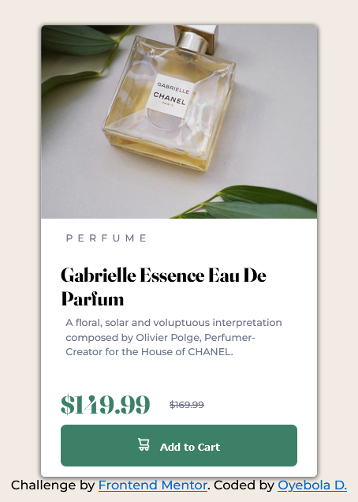
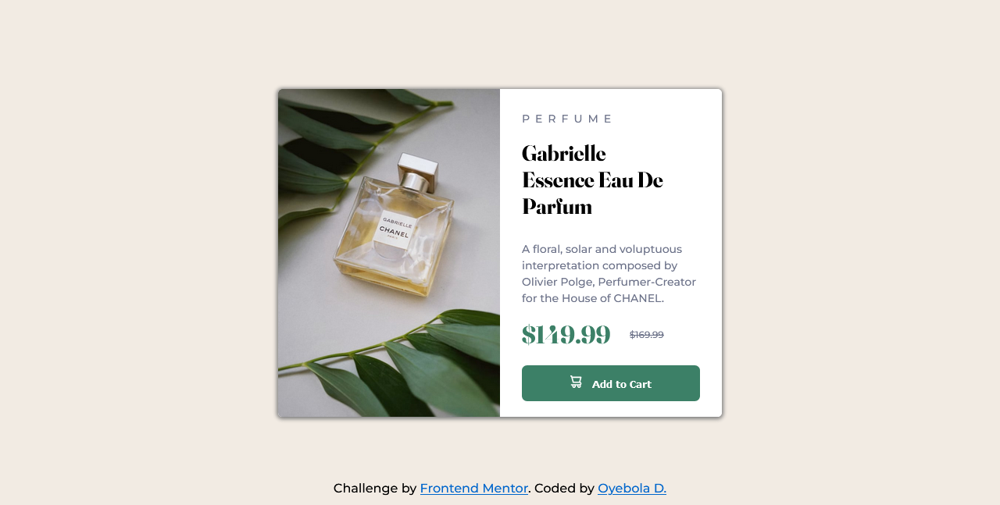

# Frontend Mentor - Product preview card component solution

This is a solution to the []. Frontend Mentor challenges help me improve my coding skills by building realistic projects. 

## Table of contents

- [Overview](#overview)
  - [The challenge](#the-challenge)
  - [Screenshot](#screenshot)
  - [Links](#links)
- [My process](#my-process)
  - [Built with](#built-with)
  - [What I learned](#what-i-learned)
  - [Continued development](#continued-development)
  - [Useful resources](#useful-resources)
- [Author](#author)
- [Acknowledgments](#acknowledgments)

## Overview
The challenge help me build the basic day-to-day sematic html component and being able to make the product card responsive and a little-bit interactive using SASS and CSS.

### The challenge

Users should be able to:
-accesibibity through semantic mark-up
- View the optimal layout depending on their device's screen size
- See hover and focus states for interactive elements

### Screenshot





### Links

- Solution URL: [Add solution URL here](https://your-solution-url.com)
- Live Site URL: [Add live site URL here](https://your-live-site-url.com)

## My process

### Built with

- Semantic HTML5 markup
- CSS custom properties
- SCSS
- Flexbox
- CSS Grid
- 

### What I learned

- Being able to use the live scss compiler and watched how my SASS stylings were transformed into 
css.
- I was able to accurately place object on web page using css grid, raltiv, blocks positioning systems.
- Designing a responsive web with HTMl5, SCSS and CSS using the VS Code code editor.
- I learnt to use images responsively through the @media query and both display-block and display-none. I added tow images in my html file but used them responsively.
- i was able to declare variables in SASS and called them in the body of my stylings.

# snipet 
```html
 
 
```

```css


@media only screen and (max-width: 555px) {
    body { 
        font-size: 0.78em;........and so on!

$Dark-cyan: hsl(158, 36%, 37%);
$cream: hsl(30, 38%, 92%);
```

### Continued development

in my next dev. project I want to build  more challenging project to include JavaScript in
the stacks I'm going to be using.

### Useful resources

- (https://www.w3schools.com) - This helped me to simplify html mark up and css media query. I really liked this pattern and will use it going forward.
- (https://www.stackoverflow.com) - This is an amazing forum which helped me quickly get solutions to problems.


## Author

- Website - [Engr. Oyebola](https://www.oyebolaportfolio.com)
- Frontend Mentor - [https://www.frontendmentor.io/profile/CreativeDadd](https://www.frontendmentor.io/profile/yourusername)
- Twitter - [@CreativeDadd](https://www.twitter.com/CreativeDadd)


## Acknowledgments

A big thanks to my beloved family, my wonderful and loving wife 'ESTHER', my son 'AYOMIKUN' and my beutiful daughter 'DESIRE' for their understanding and supports throughout my starting stages till date.
